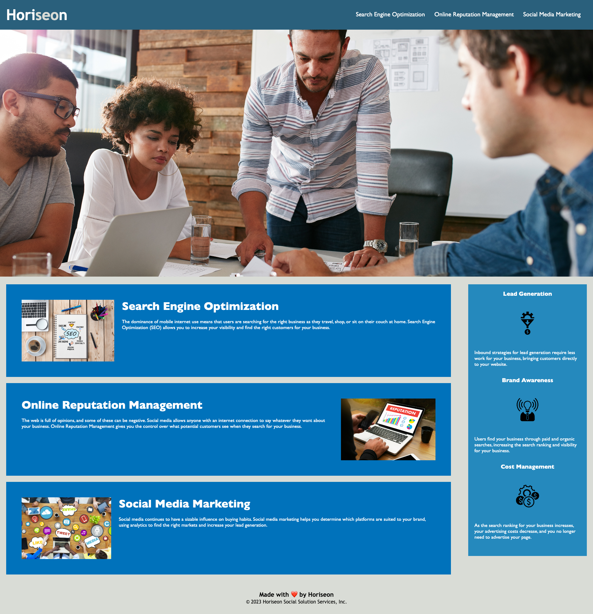

# Horiseon-Accessibility-Refactor

## Description

I was given the starter code for Horiseon's webpage and asked to refactor it to meet accessibility standards. The most important pieces of accomplishing this goal were changing the html to incldue only semantic elements and making sure all images and icons had alt-text. An accessible webpage is optimized for search engines because it provides a better user experience to people using assistive technologies.

## Usage

Access my improved Horiseon wepage at [https://gfuselier.github.io/Horiseon-Accessibility-Refactor](https://gfuselier.github.io/Horiseon-Accessibility-Refactor) 

## Credits

README Guide: [https://coding-boot-camp.github.io/full-stack/github/professional-readme-guide](https://coding-boot-camp.github.io/full-stack/github/professional-readme-guide)

## License

Please refer to the LICENSE in the repo.
